### 🧑🏻‍💻 Hi there, I'm [Ardalan Amini][WEBSITE_URL] 👋🏻

[![Website][WEBSITE_BADGE]][WEBSITE_URL]
[![LinkedIn][LINKEDIN_BADGE]][LINKEDIN_URL]
[![Twitter][TWITTER_BADGE]][TWITTER_URL]

I'm a full-stack software engineer with more experience & focus in the backend development.

- I enjoy participating in challenging ideas and great teams, gaining new experiences and learn new stuff.
- 10+ years of software engineering experience and more than 3 years of team management.
- Managed tasks & some product pipelines using Trello.
- Very much focused on maintenance & clean code and structure, efficiency, performance & overall quality.

---

#### 📈 Github Stats

---

#### 🌟 Top Repositories

<!--
**ardalanamini/ardalanamini** is a ✨ _special_ ✨ repository because its `README.md` (this file) appears on your GitHub profile.

Here are some ideas to get you started:

- 🔭 I’m currently working on ...
- 🌱 I’m currently learning ...
- 👯 I’m looking to collaborate on ...
- 🤔 I’m looking for help with ...
- 💬 Ask me about ...
- 📫 How to reach me: ...
- 😄 Pronouns: ...
- ⚡ Fun fact: ...
-->

[WEBSITE_BADGE]: https://img.shields.io/static/v1?label=Website&logo=google-chrome&style=flat&color=informational&logoColor=white&message=ardalanamini.com
[WEBSITE_URL]: https://ardalanamini.com

[LINKEDIN_BADGE]: https://img.shields.io/static/v1?label=LinkedIn&logo=linkedin&style=flat&color=blue&logoColor=white&message=ardalanamini
[LINKEDIN_URL]: https://www.linkedin.com/in/ardalanamini

[TWITTER_BADGE]: https://img.shields.io/static/v1?label=Twitter&logo=twitter&style=flat&color=blue&logoColor=white&message=AminiArdalan
[TWITTER_URL]: https://twitter.com/AminiArdalan
